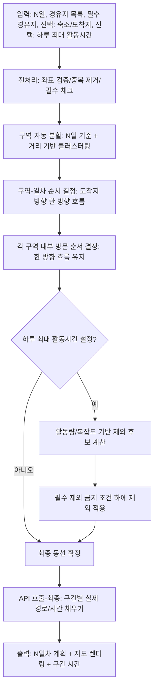
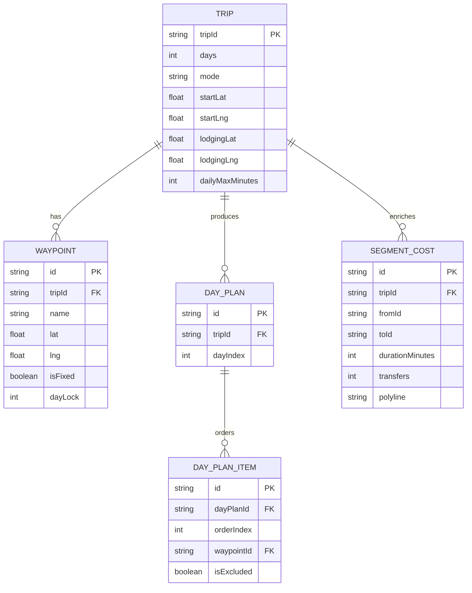

# [Ver.2 API 최소화] 알고리즘 상세 설계서

## OurRoad — “구역 단위 자동 그룹화 + N일 분할 + 한 방향 흐름 + (필요 시) 복잡도 기반 제외”

---

# Part 1. 문제의 수학적 정의 (Mathematical Modeling)

## 1.1 문제 정의 (Plain)

입력된 경유지(좌표)들을 **사용자 여행 일수 N**에 맞춰 **하루 단위로 “가까운 것끼리(구글or카카오 api를 활용해서 지도상 기준으로)” 자동 그룹화(구역화)**하고, 각 일차의 동선은 **도착지 방향으로 한 방향 흐름**을 만들며, 사용자가 **하루 최대 활동 시간**을 설정한 경우에는 **동선을 가장 복잡하게 만드는 경유지부터 제외**하여 일정에 맞춘다.

---

## 1.2 목적함수 (Objective Function)

우리의 최적화 목표는 “시간 최소”가 아니라 **모바일에서 ‘구역 단위로 깔끔하게 보이고, 되돌아감/교차가 적어 납득되는 경로’**를 만드는 것이다.

아래는 “시각적 납득(직관 점수)” 최소화:

$$
\min_{\pi, \mathcal{C}} ;;
w_D \cdot \mathrm{ZoneDispersion}(\mathcal{C})

w_B \cdot \mathrm{Backtracking}(\pi)
w_A \cdot \mathrm{Crossing}(\pi)

$$

$$
\mathcal{C}: N일차에 대응되는 구역(클러스터) 분할 결과
$$

$$
\pi: 각 일차의 방문 순서(경로)
$$

- 가중치 우선순위(사용자 결정 반영):
    
    $$
    w_D (구역 단위 방문) 가장 큼
    $$
    
    $$
    w_B (되돌아감) 2순위
    $$
    
    $$
    w_A (교차) 3순위
    $$
    
    - (꺾임/회전은 거의 무시 → 모델에서 제외)

각 항의 직관적 정의:

- $\mathrm{ZoneDispersion}$: 같은 일차에 묶인 점들이 “서로 가깝게” 모여 있는 정도(작을수록 좋음)
- $\mathrm{Backtracking}$: 진행 방향 축에 대해 “역행/되돌아감”이 발생하는 정도(작을수록 좋음)
- $\mathrm{Crossing}$: 경로 선분이 서로 교차하는 횟수(작을수록 좋음)

<aside>
💡

> **Founder's Note:**
> 
> 
> “빨리 가는 길”보다 “납득되는 길”이 목표야.
> 
> 사람은 지도를 보자마자 ‘하루는 이 구역, 다음 날은 저 구역’처럼 묶여 있으면 안심하고, 왔다 갔다(되돌아감)이나 선이 엉키면(교차) 바로 불신이 생겨.
> 
</aside>

---

## 1.3 제약조건 (Constraints)

### (1) 방문/분할 제약

- 필수 경유지(고정 경유지)는 반드시 포함:
    
    $$
    \forall v \in V_{fixed}, ; v \in \bigcup_{d=1}^{N} V_d
    $$
    

- 전체 경유지는 기본적으로 포함하되, 사용자가 하루 최대 활동시간을 설정한 경우 일부 제외 허용:
    
    $$
    \bigcup_{d=1}^{N} V_d \subseteq V_{all}, ;;
    V_{fixed} \subseteq \bigcup_{d=1}^{N} V_d
    $$
    

### (2) 일차별 분량 균등(가능하면)

- 각 일차에 할당되는 경유지 수가 최대한 비슷하게:
    
    $$
    |V_d| \approx \left\lceil \frac{|V_{all}|}{N} \right\rceil
    $$
    

### (3) 경로 형태(루프/오픈)

- 숙소(또는 출발=도착) 설정 시 루프, 아니면 오픈(편도)

<aside>
💡

> **Founder's Note:**
> 
> 
> “3일 여행에 장소 9개면 하루 3개씩”처럼 분량이 비슷하면 사용자 입장에서 ‘이 계획은 무리 없겠다’는 인상을 준다. 이건 시간 계산보다 먼저 먹히는 신뢰 장치야.
> 
</aside>

---

---

# Part 2. 알고리즘 아키텍처 (Algorithm Architecture)

## 2.1 High-Level Flow (Mermaid Flowchart)



<aside>
💡

> **Founder's Note:**
> 
> 
> 흐름은 단순해. “먼저 예쁜 계획을 만들고 → 마지막에만 실제 이동시간을 붙인다.”
> 
> 이 구조 덕분에 비용도 줄고(전체 쌍 호출 안 함), UX도 깔끔해져.
> 
</aside>

---

## 2.2 Core Logic — Heuristic 선정 이유(Trade-off Analysis)

### 왜 “최단시간 최적화(TSP/VRP류)”를 바로 쓰지 않나?

- **최단시간**은 대중교통(대기/환승/배차)까지 들어가면 **API 비용이 폭증**(쌍 비용 행렬 필요)
- 결과 경로가 사용자 눈엔 “빙글빙글/비상식”으로 보이는 경우가 많아 **납득/신뢰가 깨짐**
- 우리는 목표가 “시간 최소”가 아니라 “구역 단위 납득”이므로 목적함수 자체가 다름

### 왜 “구역→구역순서→구역내순서” 계층형(2-레벨) 구조인가?

- 지점이 늘어날수록(10~20개 이상) 한 번에 예쁘게 정렬하기 어려움
- **구역 단위로 먼저 묶으면** 모바일에서 ‘계획’처럼 보인다
- 이후 구역 간 이동은 한 방향 흐름으로 정하면 **되돌아감이 크게 줄어듦**

<aside>
💡

> **Founder's Note:**
> 
> 
> 많은 장소를 한 줄로 세우면 누구나 복잡하다고 느껴.
> 
> 사람 머리는 “오늘은 이 동네, 내일은 저 동네”처럼 덩어리로 이해하는 게 훨씬 편해.
> 
</aside>

---

## 2.3 상세 로직 (Pseudocode, 라인별 한글 주석)

> 핵심 설계 포인트
> 
> - “구역 수 ≈ N일”을 기본으로 하되, **균등 분량**을 맞추기 위해 클러스터 크기를 제어
> - “도착지 방향 한 방향 흐름”을 위해 **일차(구역) 순서**를 고정
> - “하루 최대 활동시간”이 있으면 **복잡도 유발 지점부터 제외**
> - 시간은 생성 단계에서 직접 사용하지 않되, (선택) **거리 기반 활동량 proxy**로 “초과 가능성”만 판단

```tsx
// 입력: N일, waypoints[], fixedIds[], (optional) lodging, (optional) dailyMaxMinutes
// 출력: dayPlans[] (각 일차에 할당된 waypoints와 방문 순서)

1. preprocess(waypoints)
   // 좌표 누락/비정상 값 제거, 중복 좌표 병합, id 정규화

2. determineTripMode(lodging, start, end)
   // 숙소/출발=도착이면 루프, 아니면 오픈 경로로 모드 결정

3. targetPerDay = ceil(M / N)
   // 하루 목표 방문 개수(균등 분량의 기준값)

4. clusters = balancedClustering(waypoints, N, targetPerDay)
   // 거리 기반으로 가까운 점끼리 묶되, 각 클러스터 크기가 targetPerDay 근처가 되게 균형화

5. anchorEnd = chooseEndAnchor(lodging, clusters, N)
   // 숙소가 있으면 숙소를 end anchor로 사용
   // 없으면 "다음날 시작점이 될 가능성이 큰 구역"을 추정하여 end anchor로 선택

6. orderedClusters = orderClustersOneDirection(clusters, anchorEnd)
   // end anchor에 가까운 클러스터가 마지막 날이 되도록
   // 전체가 한 방향으로 진행되도록 클러스터 순서를 결정

7. for each day d in orderedClusters:
     route_d = orderWithinClusterOneDirection(cluster_d, anchorEnd or nextDayAnchor)
     // 구역 내부도 한 방향 흐름을 유지하도록 방문 순서를 생성

8. if dailyMaxMinutes is defined:
     // 시간 자체는 생성에 쓰지 않지만, "초과 가능성"을 줄이기 위한 제외 로직 수행
     while violatesDailyLimitProxy(dayPlans, dailyMaxMinutes) and removableExists(dayPlans, fixedIds):
         candidate = selectWorstComplexityPoint(dayPlans, fixedIds)
         // 교차/되돌아감 증가를 가장 크게 만드는 지점을 찾음
         remove(candidate)
         // 선택된 경유지를 제외(필수는 제외 금지)

9. finalPlans = dayPlans
   // 여기까지는 좌표 기반(보기 좋음 기준)으로만 계획 확정

10. segmentCosts = callRoutingAPI(finalPlans)
    // 최종 계획의 "구간들"만 API로 호출하여 실제 경로/시간을 채움

11. return buildOutput(finalPlans, segmentCosts)
    // 일차별 일정 + 지도 렌더링 정보 + 구간 시간/경로 반환

```

<aside>
💡

> **Founder's Note:**
> 
> 
> “시간을 고려하지 않는데, 하루 시간 제한은 어떻게 맞춰?”
> 
> 시간 예측을 정밀하게 하려면 API를 많이 불러야 해. 우리는 그 대신 “복잡해 보이는 지점부터 빼면 대체로 일정도 단순해지고 과부하도 줄어든다”는 운영 원칙을 적용해. 그리고 마지막에만 API로 실제 시간을 붙여.
> 
</aside>

---

## 2.4 핵심 서브 알고리즘 설계 (구체화)

### A) balancedClustering(…): “N일 + M개”를 고려한 균등 구역화

요구사항:

- 가까운 점끼리 묶기(거리 기반)
- N일 기준으로 분량 균등(예: 9개면 3/3/3)
- 상황에 따라 구역 크기를 약간 유동적으로 허용

실행 전략(휴리스틱):

1. **초기 중심(seed) 선택**
    - k-means처럼 무작정 평균을 쓰기보다, “멀리 떨어진 대표점들”을 seed로 잡아 구역 분리가 잘 되게 함
2. **점 할당(가까운 seed로)**
    - 각 점을 가장 가까운 seed에 넣되, 한 구역이 targetPerDay를 넘으면 다음 가까운 seed로 넘김(용량 제한)
3. **균형화 스왑**
    - 너무 큰 구역 ↔ 너무 작은 구역 사이에서 경계 점을 스왑해 균형을 맞춤
4. **필수 경유지 보호**
    - 필수는 가능한 한 “가까운 구역”에 배치하되, 균형화 과정에서도 제외/이탈 불가

<aside>
💡

> **Founder's Note:**
> 
> 
> “구역”은 그냥 지도에서 ‘동네 덩어리’야.
> 
> 덩어리 크기가 비슷해야 ‘3일치 계획’처럼 보이고, 덩어리 안의 장소들이 가깝게 모여 있어야 ‘오늘은 이 근처만 보면 되네’가 된다.
> 
</aside>

---

### B) orderClustersOneDirection(…): 도착지 방향 한 방향 흐름

요구사항:

- 도착지(숙소) 가까운 구역이 “마지막 날”
- 전반적으로 한 방향으로 이동하는 느낌

실행 전략:

- 각 구역의 중심(centroid) 계산
- end anchor(숙소 또는 추정 종료지점)와의 거리로 정렬하되,
- 연속된 구역 간 점프가 너무 크면 “인접 구역 우선”으로 재정렬(로컬 스무딩)

<aside>
💡

> **Founder's Note:**
> 
> 
> 마지막 날이 숙소랑 가까우면, 여행이 “정리되는 느낌”이 난다.
> 
> 이건 시간이 5분 늘어도 사람들이 ‘계획이 좋다’고 느끼는 대표 패턴이야.
> 
</aside>

---

### C) selectWorstComplexityPoint(…): “복잡도 유발 지점” 제거

요구사항:

- 시간 제한을 맞춰야 할 때 “빼기 가장 좋은 곳” 우선 제거
- 기준: (b) 교차/되돌아감 유발 지점

복잡도 점수(좌표 기반):

$$
\mathrm{ComplexityImpact}(p)
= \alpha \cdot \Delta \mathrm{Backtracking}(p)

\beta \cdot \Delta \mathrm{Crossing}(p)
\gamma \cdot \Delta \mathrm{ZoneCoherence}(p)

$$

- $\Delta$는 “그 점을 포함했을 때 vs 제외했을 때” 증가량(기여도)
- $\alpha > \beta$ (되돌아감이 더 중요), $\gamma$는 보조

<aside>
💡

> **Founder's Note:**
> 
> 
> 어떤 장소 하나 때문에 동선이 갑자기 ‘튀거나’ ‘엉키면’ 사용자 납득이 깨져.
> 
> 그 지점을 빼면 계획이 다시 ‘구역 단위로 깔끔’해지고 실행도 편해진다.
> 
</aside>

---

---

# Part 3. 데이터 스키마 (Data Schema for Vibe Coding)

## 3.1 TypeScript Interfaces (Strict Typing)

```tsx
export type TripMode = "OPEN" | "LOOP";

export interface LatLng {
  lat: number; // 위도
  lng: number; // 경도
}

export interface Waypoint {
  id: string;
  name: string;
  coord: LatLng;
  isFixed: boolean; // 필수 경유지 여부
  dayLock?: number; // (옵션) 특정 일차 고정(향후 확장)
}

export interface TripInput {
  tripId: string;
  days: number; // N일
  start: LatLng; // 출발지(첫날 시작)
  end?: LatLng; // (옵션) 도착지
  lodging?: LatLng; // (옵션) 숙소(루프/종료 앵커)
  dailyMaxMinutes?: number; // (옵션) 하루 최대 활동 시간
  waypoints: Waypoint[]; // 경유지 목록
}

export interface Cluster {
  clusterId: string;
  dayIndex?: number; // 1..N (정렬 후 할당)
  waypointIds: string[];
  centroid: LatLng;
}

export interface DayPlan {
  dayIndex: number; // 1..N
  waypointOrder: string[]; // 방문 순서 (waypoint id)
  excludedWaypointIds: string[]; // 시간 제한 등으로 제외된 항목
}

export interface SegmentKey {
  fromId: string; // start 또는 waypoint id
  toId: string;   // waypoint id 또는 end/lodging
}

export interface SegmentCost {
  key: SegmentKey;
  durationMinutes: number;
  distanceMeters?: number;
  transfers?: number; // 가능하면
  polyline?: string;  // 지도 렌더링용(가능하면)
}

export interface TripOutput {
  tripId: string;
  mode: TripMode;
  clusters: Cluster[];
  dayPlans: DayPlan[];
  segmentCosts: SegmentCost[]; // 최종 구간별 실제 값(API 채움)
}

```

<aside>
💡

> **Founder's Note:**
> 
> 
> 데이터 구조를 명확히 고정하면, Vibe Coding에서 “대충 구현”이 아니라 “바로 동작하는 코드”가 나온다. 특히 `DayPlan`과 `SegmentCost` 분리 덕분에 “계획(좌표 기반)”과 “현실 값(API)”을 깔끔하게 분리할 수 있어.
> 
</aside>

---

## 3.2 Zod Validation Schema 예시

```tsx
import { z } from "zod";

export const LatLngSchema = z.object({
  lat: z.number().min(-90).max(90),
  lng: z.number().min(-180).max(180),
});

export const WaypointSchema = z.object({
  id: z.string().min(1),
  name: z.string().min(1),
  coord: LatLngSchema,
  isFixed: z.boolean(),
  dayLock: z.number().int().min(1).optional(),
});

export const TripInputSchema = z.object({
  tripId: z.string().min(1),
  days: z.number().int().min(1).max(30),
  start: LatLngSchema,
  end: LatLngSchema.optional(),
  lodging: LatLngSchema.optional(),
  dailyMaxMinutes: z.number().int().min(10).max(24 * 60).optional(),
  waypoints: z.array(WaypointSchema).min(1),
});

```

<aside>
💡

> **Founder's Note:**
> 
> 
> 입력이 조금만 깨져도(좌표 누락, days=0 같은 값) 알고리즘은 이상한 결과를 낸다. 검증을 앞단에서 딱 막아두면 “이상한 경로”에 대한 CS가 확 줄어.
> 
</aside>

---

## 3.3 ERD (Mermaid ER Diagram)



<aside>
💡

> **Founder's Note:**
> 
> 
> DB는 “계획”과 “현실 값”을 분리해서 저장해야 나중에 개선이 쉽다.
> 
> 예를 들어 같은 계획이라도 API 공급자/시간대에 따라 실제 시간은 달라질 수 있거든.
> 
</aside>

---

---

# Part 4. 예외 처리 및 한계 (Edge Cases & Fallbacks)

## 4.1 입력/구역화 Edge Cases

- **N > M** (여행 일수보다 장소가 적음)
    - 전략: 빈 날 허용 or “휴식/자유시간” dayPlan 생성(waypointOrder empty)
- **좌표가 극단적으로 퍼짐** (도시가 2~3개 섞임 수준)
    - 전략: 클러스터링이 강제 균등을 깨지 않게 “구역 응집도” 우선, 균등은 가능한 선에서만
- **중복 장소/좌표**
    - 전략: 동일 좌표 병합 + 이름만 다르면 alias 처리
- **필수 경유지가 너무 많아 하루 균등이 불가능**
    - 전략: 필수 우선 배치 후 남은 슬롯에 선택 경유지를 채움

<aside>
💡

> **Founder's Note:**
> 
> 
> 현실 데이터는 항상 지저분해. 예외 처리를 “처음부터 규칙으로” 넣으면 제품 신뢰가 올라가고, 나중에 문제 터졌을 때도 원인이 명확해져.
> 
</aside>

---

## 4.2 API/경로 Edge Cases

- **Routing API 실패/타임아웃**
    - 전략: 재시도(짧은 backoff) + 실패 구간은 “거리 기반 대체 시간(Proxy)”로 임시 표시
- **경로 없음(대중교통 미지원 구간 등)**
    - 전략: 해당 구간만 “도보/택시 fallback 옵션 표기” 또는 “세그먼트 분할(중간 지점 삽입)”(확장)
- **하루 최대 활동시간 초과(실제 API 결과로 초과가 확인)**
    - 전략(최소 호출 원칙 유지):
        1. 최초 계획에 대해 API 호출(최종 렌더링 목적)
        2. 초과 시, **복잡도 기반 제외**로 계획을 줄이고
        3. *최종 확정 1회만* 다시 API 호출(가능하면 day 단위로 부분 재호출)

<aside>
💡

> **Founder's Note:**
> 
> 
> API를 여러 번 부르면 돈이 들고 느려져. 그래서 “대부분은 한 번에 끝나게” 설계하고, 정말 초과 같은 큰 이슈가 있을 때만 한 번 더 호출하는 식이 실전에서 가장 안정적이야.
> 
</aside>

---

## 4.3 한계(명시적)

- 본 설계는 “시간 최소”가 목표가 아니므로, 최단 경로 보장은 하지 않는다.
- 다만 사용자 납득(구역 단위/한 방향 흐름)을 우선하는 제품 목표에는 정렬되어 있다.

---

## (다음 단계 준비) 구현 우선순위 제안

- v1: **구역 자동 분할 + N일 균등 + 한 방향 흐름 + 최종 API 구간 채우기**
- v1.1: **일일 최대 활동시간 초과 시 복잡도 기반 제외**
- v1.2: 숙소 미지정 시 “다음날 시작점 추정” 고도화(남은 경유지 중심 기반)

---