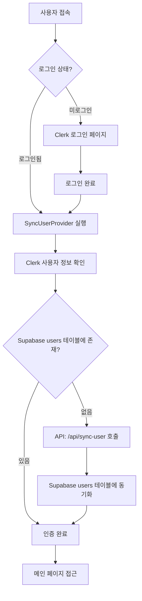
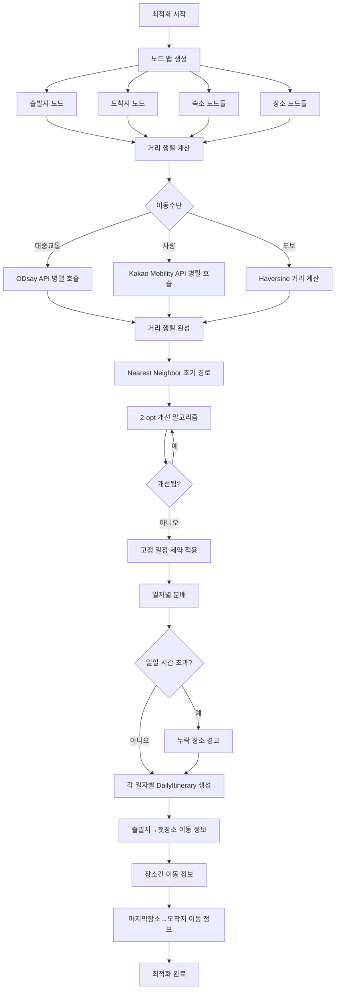
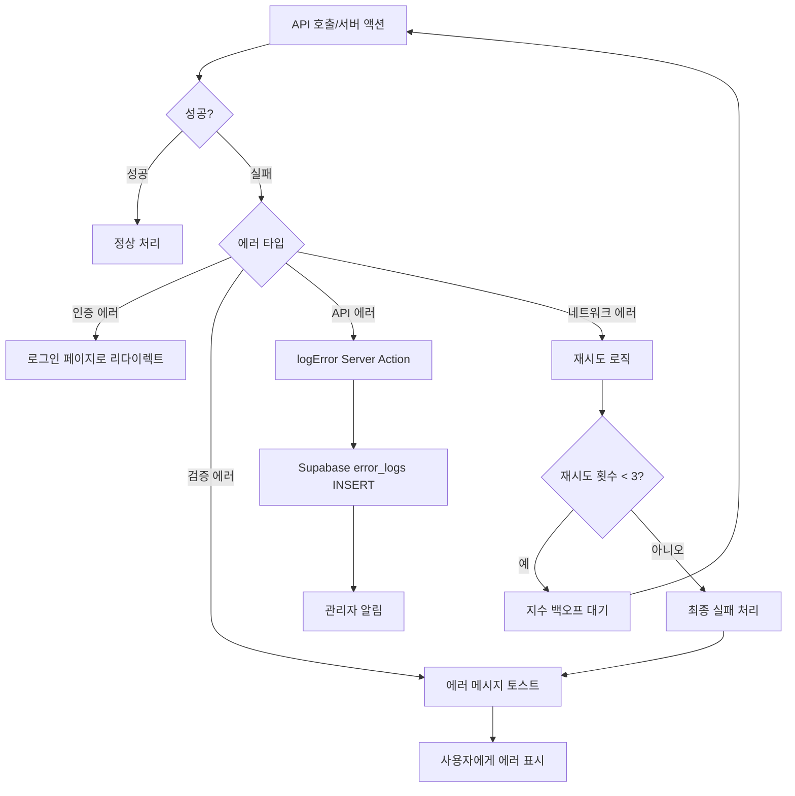
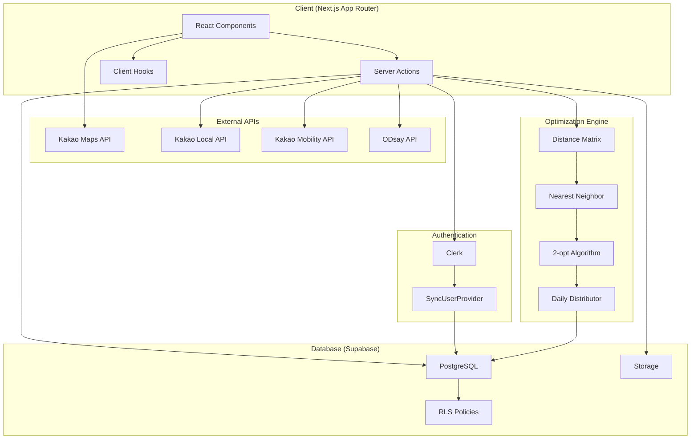
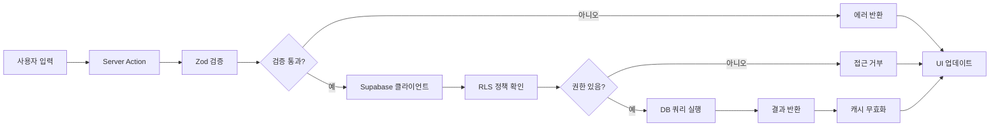
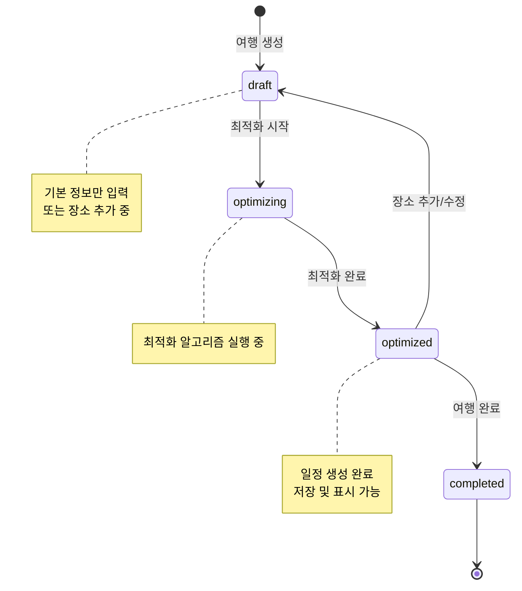
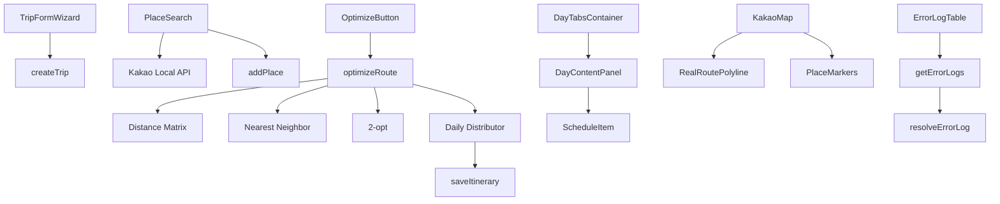

# 프로젝트 전체 워크플로우

이 문서는 OurRoad 프로젝트의 전체 워크플로우를 Mermaid 플로우차트로 시각화합니다.

## 1. 사용자 인증 및 초기화



## 2. 여행 생성 워크플로우

```mermaid
flowchart TD
    A[랜딩 페이지] --> B[새 여행 만들기 클릭]
    B --> C[/plan 페이지]
    C --> D[TripFormWizard 컴포넌트]
    D --> E[Step 1: 기본 정보 입력]
    E --> E1[여행 제목]
    E --> E2[시작일/종료일]
    E --> E3[출발지/도착지 검색]
    E --> E4[일일 시작/종료 시간]
    E --> E5[이동수단 선택]
    E1 --> F[Step 2: 확인]
    E2 --> F
    E3 --> F
    E4 --> F
    E5 --> F
    F --> G[TripConfirmDialog]
    G --> H{확인?}
    H -->|취소| D
    H -->|확인| I[createTrip Server Action]
    I --> J[Supabase trips 테이블 INSERT]
    J --> K{성공?}
    K -->|실패| L[에러 토스트]
    K -->|성공| M[여행 ID 반환]
    L --> D
    M --> N[/plan/tripId 페이지로 이동]
```

## 3. 장소 추가 워크플로우

```mermaid
flowchart TD
    A[/plan/tripId 페이지] --> B[장소 추가 카드 클릭]
    B --> C[/plan/tripId/places 페이지]
    C --> D{초기 로드}
    D --> E[DB에서 장소 조회]
    E --> F{장소 있음?}
    F -->|있음| G[장소 목록 표시]
    F -->|없음| H[sessionStorage에서 조회]
    H --> I{있음?}
    I -->|있음| G
    I -->|없음| J[빈 목록 표시]
    G --> K[장소 추가 버튼 클릭]
    J --> K
    K --> L[PlaceSearch Sheet 열림]
    L --> M[Kakao Local API 검색]
    M --> N[검색 결과 표시]
    N --> O[장소 선택]
    O --> P[addPlace Server Action]
    P --> Q[Supabase trip_places 테이블 INSERT]
    Q --> R{성공?}
    R -->|실패| S[에러 토스트]
    R -->|성공| T[로컬 상태 업데이트]
    S --> L
    T --> U[장소 목록에 추가]
    U --> V[체류 시간 설정 가능]
    V --> W[저장 완료 버튼]
    W --> X[updateTrip: status = 'optimizing']
    X --> Y[/plan/tripId로 돌아가기]
```

## 4. 고정 일정 설정 워크플로우 (선택)

```mermaid
flowchart TD
    A[/plan/tripId 페이지] --> B[고정 일정 설정 카드 클릭]
    B --> C[/plan/tripId/schedule 페이지]
    C --> D[고정 일정 목록 표시]
    D --> E[고정 일정 추가 버튼]
    E --> F[FixedScheduleForm]
    F --> G[장소 선택]
    G --> H[날짜 선택]
    H --> I[시작/종료 시간 입력]
    I --> J[저장]
    J --> K[addFixedSchedule Server Action]
    K --> L[Supabase trip_fixed_schedules INSERT]
    L --> M{성공?}
    M -->|실패| N[에러 토스트]
    M -->|성공| O[목록 업데이트]
    N --> F
    O --> P[일정 타임라인 표시]
```

## 5. 최적화 실행 워크플로우

```mermaid
flowchart TD
    A[/plan/tripId 페이지] --> B[일정 최적화하기 버튼]
    B --> C[updateTrip: status = 'optimizing']
    C --> D[/my/trips/tripId 페이지로 이동]
    D --> E{자동 최적화 조건}
    E -->|status = draft/optimizing| F[optimizeRoute Server Action 호출]
    E -->|status = optimized| G[기존 일정 표시]
    F --> H[1. 인증 확인]
    H --> I[2. 입력 검증]
    I --> J[3. 여행/장소/고정일정 조회]
    J --> K{이동수단?}
    K -->|대중교통| L[optimizePublicTransitRoute]
    K -->|차량/도보| M[createDistanceMatrix]
    L --> N[ODsay API 호출]
    M --> O[Kakao Mobility API 호출]
    N --> P[거리 행렬 생성]
    O --> P
    P --> Q[nearestNeighborWithEndpoints]
    Q --> R[twoOptWithEndpoints]
    R --> S[distributeToDaily]
    S --> T[일자별 분배]
    T --> U[createDailyItinerary]
    U --> V[각 구간 이동 정보 조회]
    V --> W[DailyItinerary 생성]
    W --> X[saveItinerary Server Action]
    X --> Y[Supabase trip_itineraries INSERT]
    Y --> Z[updateTrip: status = 'optimized']
    Z --> AA[일정 표시]
    AA --> AB[지도 경로 표시]
    AB --> AC[일자별 탭 네비게이션]
```

## 6. 최적화 알고리즘 상세 플로우



## 7. 일정 표시 및 네비게이션 워크플로우

```mermaid
flowchart TD
    A[/my/trips/tripId 페이지] --> B[여행 상세 로드]
    B --> C{일정 있음?}
    C -->|없음| D[최적화 안내]
    C -->|있음| E[일자별 탭 생성]
    E --> F[DayTabsContainer]
    F --> G[선택된 일자 표시]
    G --> H[DayContentPanel]
    H --> I[일정 타임라인]
    I --> J[각 장소별 ScheduleItem]
    J --> K[도착 시간]
    J --> L[체류 시간]
    J --> M[출발 시간]
    J --> N[다음 장소 이동 정보]
    N --> O[KakaoMap 컴포넌트]
    O --> P[경로 폴리라인 표시]
    P --> Q[장소 마커 표시]
    Q --> R[출발지/도착지 마커]
    R --> S[스와이프 제스처]
    S --> T{좌우 스와이프}
    T -->|왼쪽| U[다음 일자]
    T -->|오른쪽| V[이전 일자]
    U --> G
    V --> G
    G --> W[네비게이션 버튼]
    W --> X[/navigate/tripId 페이지]
```

## 8. 공유 워크플로우

```mermaid
flowchart TD
    A[/my/trips/tripId 페이지] --> B[공유 버튼 클릭]
    B --> C{Web Share API 지원?}
    C -->|지원| D[navigator.share 호출]
    C -->|미지원| E[URL 클립보드 복사]
    D --> F[공유 완료]
    E --> F
    F --> G[공유 링크: /share/tripId]
    G --> H[다른 사용자 접근]
    H --> I[getSharedTrip Server Action]
    I --> J[공개 여행 정보 조회]
    J --> K{일정 있음?}
    K -->|있음| L[일정 표시]
    K -->|없음| M[일정 없음 안내]
    L --> N[읽기 전용 모드]
    M --> N
    N --> O[회원가입 CTA]
```

## 9. 에러 처리 워크플로우



## 10. 관리자 에러 로그 관리 워크플로우

```mermaid
flowchart TD
    A[관리자 로그인] --> B{admin_users 테이블 확인}
    B -->|권한 있음| C[/admin/error-logs 페이지]
    B -->|권한 없음| D[접근 거부]
    C --> E[에러 로그 목록 조회]
    E --> F[필터링 옵션]
    F --> F1[해결 상태]
    F --> F2[심각도]
    F --> F3[에러 코드]
    F --> F4[발생 위치]
    F --> F5[기간]
    F1 --> G[필터 적용]
    F2 --> G
    F3 --> G
    F4 --> G
    F5 --> G
    G --> H[필터된 로그 표시]
    H --> I[에러 상세 보기]
    I --> J[스택 트레이스 확인]
    J --> K[해결 처리]
    K --> L[resolveErrorLog Server Action]
    L --> M[해결 메모 입력]
    M --> N[error_logs UPDATE]
    N --> O[해결 완료 표시]
    H --> P[삭제]
    P --> Q{해결됨?}
    Q -->|예| R[deleteErrorLog Server Action]
    Q -->|아니오| S[삭제 불가 안내]
    R --> T[error_logs DELETE]
```

## 11. 전체 시스템 아키텍처 플로우



## 12. 데이터 흐름 다이어그램



## 주요 상태 전이



## 주요 컴포넌트 상호작용



---

이 문서는 프로젝트의 전체 워크플로우를 시각화하여 개발자들이 시스템의 동작 방식을 이해하는 데 도움을 줍니다.
