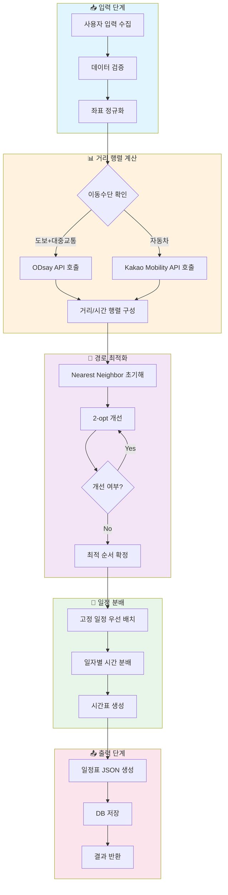
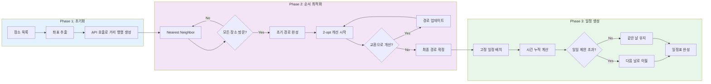
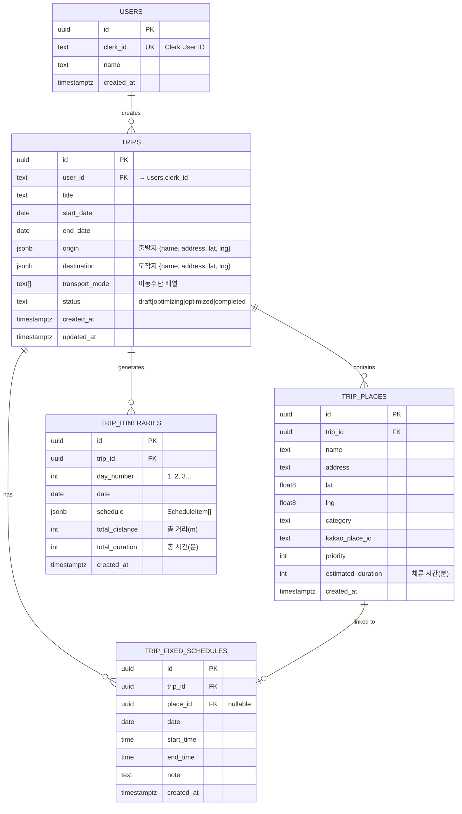
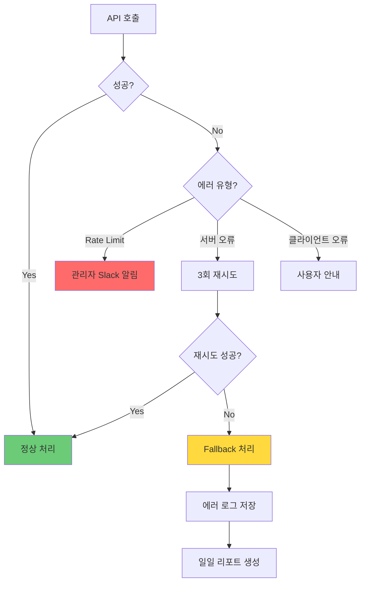

# 알고리즘 상세 설계서 (Technical Specification)
## OurRoad - 여행 동선 최적화 서비스

**Version:** 1.0.0
**Last Updated:** 2025-01-15
**Author:** System Architecture Team

---

## Executive Summary

본 문서는 OurRoad 서비스의 핵심인 **여행 동선 최적화 알고리즘**에 대한 상세 기술 명세서입니다. 사용자가 입력한 여행 정보를 바탕으로 최적의 방문 순서, 일자별 배치, 구간별 이동방법을 자동으로 생성하는 시스템의 수학적 모델링, 알고리즘 아키텍처, 데이터 스키마를 정의합니다.

---

# Part 1. 문제의 수학적 정의 (Mathematical Modeling)

## 1.1 문제 분류

OurRoad의 핵심 문제는 **Traveling Salesman Problem (TSP)**의 변형입니다. 고전적인 TSP와 달리, 다음과 같은 추가 제약이 존재합니다:

| 제약 유형 | 설명 |
|----------|------|
| 시작/종료점 고정 | 출발지와 도착지가 동일하지 않을 수 있음 |
| 시간 창 제약 (Time Windows) | 고정 일정이 있는 장소는 특정 시간에 방문 필수 |
| 일일 시간 제한 | 하루 최대 활동 시간 제한 (기본 8시간) |
| 다중 날짜 분배 | 여러 날에 걸쳐 장소 방문을 분배 |

이러한 특성으로 인해 본 문제는 **Time-Windowed Vehicle Routing Problem (TWVRP)**에 더 가깝습니다.

---

## 1.2 Objective Function (목적 함수)

### 1.2.1 Primary Objective: 총 이동 비용 최소화

$$
\min Z = \sum_{d=1}^{D} \sum_{i=0}^{n_d} \sum_{j=0}^{n_d} c_{ij} \cdot x_{ij}^d
$$

**변수 정의:**
- $D$: 총 여행 일수
- $n_d$: $d$일차에 방문할 장소 수
- $c_{ij}$: 장소 $i$에서 $j$까지의 이동 비용 (시간 + 거리 가중치)
- $x_{ij}^d$: $d$일차에 $i$에서 $j$로 이동하면 1, 아니면 0 (Decision Variable)

### 1.2.2 Cost Function 상세 정의

이동 비용 $c_{ij}$는 시간과 거리의 가중 합으로 정의됩니다:

$$
c_{ij} = \alpha \cdot t_{ij} + \beta \cdot d_{ij}
$$

**파라미터:**
- $t_{ij}$: 장소 $i$에서 $j$까지의 이동 시간 (분)
- $d_{ij}$: 장소 $i$에서 $j$까지의 이동 거리 (km)
- $\alpha$: 시간 가중치 (기본값: 1.0)
- $\beta$: 거리 가중치 (기본값: 0.1)

> 💡 **Founder's Note:**
> "비용"이라고 하면 돈을 떠올리기 쉽지만, 여기서의 비용은 **"여행의 피로도"**라고 생각하면 됩니다.
>
> 예를 들어, 두 장소 A와 B 사이를 이동할 때:
> - 30분 걸리고 5km 거리 → 피로도 = 30 × 1.0 + 5 × 0.1 = 30.5
> - 1시간 걸리고 20km 거리 → 피로도 = 60 × 1.0 + 20 × 0.1 = 62
>
> 시스템은 이 "피로도"의 총합이 가장 작은 경로를 찾습니다. 사용자가 덜 지치고 더 많은 곳을 효율적으로 돌 수 있는 최적의 순서를 계산하는 것이죠.

---

## 1.3 Constraints (제약 조건)

### 1.3.1 모든 장소 방문 제약 (Visit Constraint)

모든 장소는 정확히 한 번씩 방문되어야 합니다:

$$
\sum_{d=1}^{D} \sum_{j=0}^{n} x_{ij}^d = 1, \quad \forall i \in V \setminus \{0, n+1\}
$$

### 1.3.2 흐름 보존 제약 (Flow Conservation)

각 날짜에서 들어오는 경로와 나가는 경로의 수는 동일해야 합니다:

$$
\sum_{i=0}^{n} x_{ij}^d = \sum_{k=0}^{n} x_{jk}^d, \quad \forall j \in V, \forall d \in D
$$

### 1.3.3 일일 시간 제한 제약 (Daily Time Limit)

각 날짜의 총 활동 시간은 최대 허용 시간을 초과할 수 없습니다:

$$
\sum_{i=0}^{n_d} \sum_{j=0}^{n_d} (t_{ij} + s_j) \cdot x_{ij}^d \leq T_{max}, \quad \forall d \in D
$$

**변수 정의:**
- $s_j$: 장소 $j$에서의 체류 시간 (분)
- $T_{max}$: 하루 최대 활동 시간 (기본 480분 = 8시간)

### 1.3.4 고정 일정 제약 (Fixed Schedule Constraint)

고정 일정이 있는 장소 $f$는 지정된 날짜 $d_f$와 시간 창 $[a_f, b_f]$ 내에 방문해야 합니다:

$$
a_f \leq \tau_f \leq b_f
$$
$$
\text{where } \tau_f = \text{arrival time at place } f
$$

### 1.3.5 시간 순서 제약 (Time Ordering)

장소 $i$를 방문한 후 장소 $j$를 방문하면, 도착 시간이 논리적으로 연속되어야 합니다:

$$
\tau_j \geq \tau_i + s_i + t_{ij} - M(1 - x_{ij}^d)
$$

**변수 정의:**
- $M$: 충분히 큰 상수 (Big-M method)
- $\tau_i$: 장소 $i$ 도착 시간

> 💡 **Founder's Note:**
> 제약 조건들은 **"여행의 규칙"**이라고 생각하면 됩니다.
>
> 1. **모든 장소 방문**: 여행 계획에 넣은 모든 곳은 반드시 한 번씩 가야 합니다.
> 2. **일일 시간 제한**: 하루에 8시간 이상 돌아다니면 너무 지칩니다. 적당히 쉬어야죠.
> 3. **고정 일정**: "롯데월드 티켓이 오후 2시부터야!"라면 그 시간에 맞춰야 합니다.
>
> 시스템은 이 모든 규칙을 지키면서 가장 효율적인 경로를 찾습니다. 규칙을 어기는 경로는 아무리 효율적이어도 선택되지 않습니다.

---

# Part 2. 알고리즘 아키텍처 (Algorithm Architecture)

## 2.1 High-Level Flow



---

## 2.2 알고리즘 선정 분석 (Trade-off Analysis)

### 2.2.1 후보 알고리즘 비교

| 알고리즘 | 시간 복잡도 | 해 품질 | 구현 복잡도 | 실시간 적합성 |
|---------|------------|--------|------------|--------------|
| Brute Force | $O(n!)$ | 최적해 | 낮음 | ❌ (10개 초과 불가) |
| Dynamic Programming | $O(n^2 \cdot 2^n)$ | 최적해 | 중간 | ❌ (20개 초과 불가) |
| Branch & Bound | $O(n!)$ (worst) | 최적해 | 높음 | ⚠️ (불안정) |
| **Nearest Neighbor** | $O(n^2)$ | 근사해 | **낮음** | ✅ |
| **2-opt Improvement** | $O(n^2)$ per iter | 개선해 | **중간** | ✅ |
| Genetic Algorithm | $O(g \cdot p \cdot n)$ | 준최적해 | 높음 | ⚠️ (튜닝 필요) |
| Simulated Annealing | $O(k \cdot n^2)$ | 준최적해 | 중간 | ✅ |

### 2.2.2 선정 근거

**선정: Nearest Neighbor + 2-opt Hybrid**

1. **시간 복잡도 우수**: 30개 장소 기준 1초 미만 처리 가능
2. **구현 용이성**: 직관적인 로직으로 디버깅과 유지보수 용이
3. **해 품질**: 평균적으로 최적해의 5~10% 이내 근사
4. **확장성**: 추후 다른 메타휴리스틱으로 교체 용이

> 💡 **Founder's Note:**
> 완벽한 답(최적해)을 찾으려면 모든 경우의 수를 다 계산해야 합니다. 10개 장소면 경우의 수가 3,628,800개, 15개면 1조 개가 넘습니다.
>
> 그래서 우리는 **"거의 완벽한 답을 빠르게"** 찾는 방법을 선택했습니다:
>
> 1. **Nearest Neighbor**: "지금 위치에서 가장 가까운 곳으로 가자"를 반복합니다. 마치 눈앞의 편의점만 보고 걸어가는 것처럼요. 빠르지만 가끔 비효율적인 경로가 나옵니다.
>
> 2. **2-opt 개선**: 완성된 경로에서 "이 구간을 저 구간과 바꾸면 더 짧지 않을까?"를 반복해서 확인합니다. 실타래가 엉킨 것을 풀어서 직선으로 만드는 것과 같습니다.

---

## 2.3 Core Logic: Pseudocode

### 2.3.1 Nearest Neighbor Algorithm

```typescript
/**
 * Nearest Neighbor 알고리즘으로 초기 경로 생성
 *
 * @param distanceMatrix - 장소 간 거리 행렬 (n x n)
 * @param startIndex - 시작 장소 인덱스 (출발지)
 * @param endIndex - 종료 장소 인덱스 (도착지, 시작과 다를 수 있음)
 * @returns 방문 순서 배열
 */
function nearestNeighbor(
  distanceMatrix: number[][],
  startIndex: number,
  endIndex: number
): number[] {
  // n: 총 장소 수
  const n = distanceMatrix.length;

  // visited: 방문 여부 추적 배열 (모두 false로 초기화)
  const visited: boolean[] = new Array(n).fill(false);

  // route: 최종 경로를 저장할 배열
  const route: number[] = [];

  // 1단계: 출발지를 경로에 추가하고 방문 표시
  let current = startIndex;
  route.push(current);
  visited[current] = true;

  // 도착지가 시작지와 다르면 예약해둠 (마지막에 추가)
  if (endIndex !== startIndex) {
    visited[endIndex] = true;
  }

  // 2단계: 모든 중간 장소를 방문할 때까지 반복
  // (출발지, 도착지 제외한 n-2개 또는 n-1개 장소)
  const targetVisits = endIndex !== startIndex ? n - 2 : n - 1;

  while (route.length <= targetVisits) {
    // 현재 위치에서 가장 가까운 미방문 장소 탐색
    let nearestDistance = Infinity;
    let nearestIndex = -1;

    // 모든 장소를 순회하며 최소 거리 찾기
    for (let j = 0; j < n; j++) {
      // 미방문 장소 중 가장 가까운 곳 선택
      if (!visited[j] && distanceMatrix[current][j] < nearestDistance) {
        nearestDistance = distanceMatrix[current][j];
        nearestIndex = j;
      }
    }

    // 3단계: 더 이상 방문할 곳이 없으면 종료
    if (nearestIndex === -1) break;

    // 4단계: 선택된 장소를 경로에 추가
    route.push(nearestIndex);
    visited[nearestIndex] = true;
    current = nearestIndex;
  }

  // 5단계: 도착지가 별도로 지정된 경우 마지막에 추가
  if (endIndex !== startIndex) {
    route.push(endIndex);
  }

  return route;
}
```

### 2.3.2 2-opt Improvement Algorithm

```typescript
/**
 * 2-opt 알고리즘으로 경로 개선
 *
 * 원리: 경로에서 두 엣지를 선택해 교차 여부를 확인하고,
 *       교차하면 중간 구간을 뒤집어서 경로 길이를 단축
 *
 * @param route - 현재 경로 (장소 인덱스 배열)
 * @param distanceMatrix - 거리 행렬
 * @param maxIterations - 최대 반복 횟수 (무한 루프 방지)
 * @returns 개선된 경로
 */
function twoOptImprove(
  route: number[],
  distanceMatrix: number[][],
  maxIterations: number = 100
): number[] {
  // 경로 복사 (원본 변경 방지)
  let bestRoute = [...route];
  let improved = true;
  let iterations = 0;

  // 개선이 없을 때까지 또는 최대 반복 횟수까지 반복
  while (improved && iterations < maxIterations) {
    improved = false;
    iterations++;

    // i: 첫 번째 교환 지점 (시작점 제외)
    for (let i = 1; i < bestRoute.length - 2; i++) {
      // j: 두 번째 교환 지점
      for (let j = i + 1; j < bestRoute.length - 1; j++) {

        // 현재 연결 비용 계산:
        // 엣지 (i-1, i)와 엣지 (j, j+1)의 합
        const currentCost =
          distanceMatrix[bestRoute[i - 1]][bestRoute[i]] +
          distanceMatrix[bestRoute[j]][bestRoute[j + 1]];

        // 교환 후 연결 비용 계산:
        // 엣지 (i-1, j)와 엣지 (i, j+1)의 합
        const newCost =
          distanceMatrix[bestRoute[i - 1]][bestRoute[j]] +
          distanceMatrix[bestRoute[i]][bestRoute[j + 1]];

        // 교환이 더 나은 경우: i부터 j까지 구간을 뒤집음
        if (newCost < currentCost) {
          // 구간 [i, j]를 reverse
          const reversed = bestRoute.slice(i, j + 1).reverse();
          bestRoute = [
            ...bestRoute.slice(0, i),      // 0 ~ i-1 유지
            ...reversed,                    // i ~ j 뒤집기
            ...bestRoute.slice(j + 1)       // j+1 ~ end 유지
          ];
          improved = true;
        }
      }
    }
  }

  return bestRoute;
}
```

### 2.3.3 Daily Distribution Algorithm

```typescript
/**
 * 최적화된 경로를 일자별로 분배
 *
 * @param route - 최적화된 방문 순서
 * @param places - 장소 정보 배열
 * @param travelTimes - 구간별 이동 시간
 * @param fixedSchedules - 고정 일정 목록
 * @param maxDailyMinutes - 하루 최대 활동 시간 (분)
 * @returns 일자별 일정 배열
 */
function distributeByDays(
  route: number[],
  places: Place[],
  travelTimes: number[][],
  fixedSchedules: FixedSchedule[],
  maxDailyMinutes: number = 480
): DailyItinerary[] {
  const days: DailyItinerary[] = [];
  let currentDay: DailyItinerary = createNewDay(1);
  let accumulatedMinutes = 0;

  // 1단계: 고정 일정을 날짜별로 그룹화
  const fixedByDate = groupFixedSchedulesByDate(fixedSchedules);

  // 2단계: 경로의 각 장소를 순회하며 일자 배정
  for (let i = 0; i < route.length; i++) {
    const placeIndex = route[i];
    const place = places[placeIndex];

    // 이전 장소에서 현재 장소까지 이동 시간
    const travelTime = i > 0
      ? travelTimes[route[i - 1]][placeIndex]
      : 0;

    // 현재 장소 체류 시간
    const stayDuration = place.estimatedDuration;

    // 이 장소를 추가했을 때의 총 소요 시간
    const totalWithThisPlace = accumulatedMinutes + travelTime + stayDuration;

    // 3단계: 일일 제한 시간 초과 체크
    if (totalWithThisPlace > maxDailyMinutes && currentDay.places.length > 0) {
      // 현재 일차 마감하고 새로운 일차 시작
      days.push(currentDay);
      currentDay = createNewDay(days.length + 1);
      accumulatedMinutes = 0;
    }

    // 4단계: 고정 일정 체크 - 특정 날짜에 고정된 장소인지 확인
    const fixedForPlace = findFixedScheduleForPlace(fixedByDate, place.id);
    if (fixedForPlace) {
      // 고정 일정이 있으면 해당 날짜에 강제 배정
      ensurePlaceOnDate(days, currentDay, place, fixedForPlace);
    }

    // 5단계: 장소를 현재 일차에 추가
    currentDay.places.push({
      ...place,
      order: currentDay.places.length + 1,
      travelTimeFromPrev: travelTime,
    });
    accumulatedMinutes += travelTime + stayDuration;
  }

  // 마지막 일차 추가
  if (currentDay.places.length > 0) {
    days.push(currentDay);
  }

  return days;
}
```

> 💡 **Founder's Note:**
> 알고리즘의 작동을 쉽게 설명하면:
>
> **1단계 (Nearest Neighbor)**: 택시 기사님이 손님을 태우고 "어디로 갈까요?" 하면 "일단 가장 가까운 데부터 가죠"라고 하는 것과 같습니다.
>
> **2단계 (2-opt)**: 완성된 경로를 보고 "어? 여기서 저기로 갔다가 다시 돌아오네? 순서를 바꾸면 훨씬 가깝겠는데?"를 찾아서 고치는 과정입니다.
>
> **3단계 (Daily Distribution)**: 하루에 8시간만 돌아다닐 수 있다고 하면, 8시간이 넘어가면 "오늘은 여기까지! 나머지는 내일!"이라고 자동으로 나눠주는 것입니다.

---

## 2.4 최적화 상세 흐름도



---

# Part 3. 데이터 스키마 (Data Schema for Vibe Coding)

## 3.1 TypeScript Interfaces

### 3.1.1 Core Domain Types

```typescript
// ============================================
// 📍 장소 관련 타입
// ============================================

/** 좌표 정보 */
interface Coordinate {
  lat: number;   // 위도 (-90 ~ 90)
  lng: number;   // 경도 (-180 ~ 180)
}

/** 장소 기본 정보 */
interface Place {
  id: string;                    // UUID
  name: string;                  // 장소명
  address: string;               // 주소
  coordinate: Coordinate;        // 좌표
  category?: PlaceCategory;      // 카테고리
  kakaoPlaceId?: string;         // Kakao Place ID (연동용)
  estimatedDuration: number;     // 예상 체류 시간 (분)
  priority?: number;             // 사용자 우선순위
}

/** 장소 카테고리 */
type PlaceCategory =
  | 'tourist_attraction'  // 관광지
  | 'restaurant'          // 음식점
  | 'cafe'                // 카페
  | 'shopping'            // 쇼핑
  | 'accommodation'       // 숙박
  | 'entertainment'       // 엔터테인먼트
  | 'culture'             // 문화시설
  | 'nature'              // 자연/공원
  | 'other';              // 기타

// ============================================
// 🚗 이동 관련 타입
// ============================================

/** 이동 수단 */
type TransportMode = 'walking' | 'public' | 'car';

/** 구간 이동 정보 */
interface RouteSegment {
  mode: TransportMode;           // 이동 수단
  distance: number;              // 거리 (미터)
  duration: number;              // 소요 시간 (분)
  description?: string;          // 설명 (예: "3호선 안국역 → 을지로3가역")
  polyline?: string;             // 경로 폴리라인 (지도 표시용)
  fare?: number;                 // 요금 (원)
}

// ============================================
// 📅 일정 관련 타입
// ============================================

/** 고정 일정 */
interface FixedSchedule {
  id: string;
  placeId: string;               // 연결된 장소 ID
  date: string;                  // 날짜 (YYYY-MM-DD)
  startTime: string;             // 시작 시간 (HH:mm)
  endTime: string;               // 종료 시간 (HH:mm)
  note?: string;                 // 메모
}

/** 일정 항목 (최적화 결과) */
interface ScheduleItem {
  order: number;                 // 방문 순서
  placeId: string;               // 장소 ID
  placeName: string;             // 장소명
  arrivalTime: string;           // 도착 시간 (HH:mm)
  departureTime: string;         // 출발 시간 (HH:mm)
  duration: number;              // 체류 시간 (분)
  transportToNext?: RouteSegment; // 다음 장소까지 이동 정보
  isFixed: boolean;              // 고정 일정 여부
}

/** 일자별 일정 */
interface DailyItinerary {
  dayNumber: number;             // 일차 (1, 2, 3...)
  date: string;                  // 날짜 (YYYY-MM-DD)
  schedule: ScheduleItem[];      // 일정 항목 배열
  totalDistance: number;         // 총 이동 거리 (미터)
  totalDuration: number;         // 총 소요 시간 (분)
  startTime: string;             // 일과 시작 시간
  endTime: string;               // 일과 종료 시간
}

// ============================================
// 🎒 여행 계획 타입
// ============================================

/** 여행 계획 상태 */
type TripStatus = 'draft' | 'optimizing' | 'optimized' | 'completed';

/** 여행 계획 */
interface Trip {
  id: string;
  userId: string;                // Clerk User ID
  title: string;                 // 여행 제목
  startDate: string;             // 시작일 (YYYY-MM-DD)
  endDate: string;               // 종료일 (YYYY-MM-DD)
  origin: Place;                 // 출발지
  destination: Place;            // 도착지
  transportModes: TransportMode[]; // 선택한 이동 수단
  status: TripStatus;            // 상태
  places: Place[];               // 방문 장소 목록
  fixedSchedules: FixedSchedule[]; // 고정 일정
  itinerary?: DailyItinerary[];  // 최적화된 일정 (결과)
  createdAt: string;
  updatedAt: string;
}
```

### 3.1.2 Algorithm Input/Output Types

```typescript
// ============================================
// 🔄 최적화 엔진 Input/Output
// ============================================

/** 최적화 요청 */
interface OptimizeRequest {
  tripId: string;
  places: Place[];
  origin: Coordinate;
  destination: Coordinate;
  transportModes: TransportMode[];
  fixedSchedules: FixedSchedule[];
  options: OptimizeOptions;
}

/** 최적화 옵션 */
interface OptimizeOptions {
  maxDailyMinutes: number;       // 일일 최대 활동 시간 (기본: 480)
  startHour: number;             // 하루 시작 시간 (기본: 9)
  endHour: number;               // 하루 종료 시간 (기본: 21)
  algorithm: 'nearest_neighbor' | 'genetic' | 'simulated_annealing';
  improvementIterations: number; // 2-opt 반복 횟수 (기본: 100)
  timeWeight: number;            // 시간 가중치 α (기본: 1.0)
  distanceWeight: number;        // 거리 가중치 β (기본: 0.1)
}

/** 최적화 결과 */
interface OptimizeResult {
  success: boolean;
  tripId: string;
  itinerary: DailyItinerary[];
  statistics: OptimizeStatistics;
  errors?: OptimizeError[];
}

/** 최적화 통계 */
interface OptimizeStatistics {
  totalPlaces: number;           // 총 장소 수
  totalDays: number;             // 총 일수
  totalDistance: number;         // 총 이동 거리 (km)
  totalDuration: number;         // 총 이동 시간 (분)
  averageDailyDistance: number;  // 일평균 이동 거리
  optimizationTimeMs: number;    // 최적화 소요 시간 (ms)
  improvementPercentage: number; // 초기 대비 개선율 (%)
}

/** 최적화 오류 */
interface OptimizeError {
  code: OptimizeErrorCode;
  message: string;
  placeId?: string;
  details?: Record<string, unknown>;
}

type OptimizeErrorCode =
  | 'INVALID_COORDINATES'
  | 'API_RATE_LIMIT'
  | 'ROUTE_NOT_FOUND'
  | 'FIXED_SCHEDULE_CONFLICT'
  | 'TIMEOUT'
  | 'UNKNOWN';

// ============================================
// 📊 거리 행렬 타입
// ============================================

/** 거리 행렬 */
interface DistanceMatrix {
  places: string[];              // 장소 ID 배열 (행/열 인덱스 매핑)
  distances: number[][];         // 거리 (미터)
  durations: number[][];         // 시간 (분)
  modes: TransportMode[][];      // 각 구간 이동 수단
}
```

---

## 3.2 Zod Validation Schemas

```typescript
import { z } from 'zod';

// ============================================
// 📍 좌표 검증
// ============================================

export const coordinateSchema = z.object({
  lat: z.number()
    .min(-90, '위도는 -90 이상이어야 합니다')
    .max(90, '위도는 90 이하여야 합니다'),
  lng: z.number()
    .min(-180, '경도는 -180 이상이어야 합니다')
    .max(180, '경도는 180 이하여야 합니다'),
});

// ============================================
// 🏢 장소 검증
// ============================================

export const placeCategorySchema = z.enum([
  'tourist_attraction',
  'restaurant',
  'cafe',
  'shopping',
  'accommodation',
  'entertainment',
  'culture',
  'nature',
  'other',
]);

export const placeSchema = z.object({
  id: z.string().uuid(),
  name: z.string().min(1, '장소명은 필수입니다').max(100),
  address: z.string().min(1, '주소는 필수입니다').max(200),
  coordinate: coordinateSchema,
  category: placeCategorySchema.optional(),
  kakaoPlaceId: z.string().optional(),
  estimatedDuration: z.number().positive('체류 시간은 양수여야 합니다'),  // 사용자가 직접 제공
  priority: z.number().int().min(1).max(100).optional(),
});

// ============================================
// 📅 고정 일정 검증
// ============================================

const timeRegex = /^([01]?[0-9]|2[0-3]):[0-5][0-9]$/;

export const fixedScheduleSchema = z.object({
  id: z.string().uuid(),
  placeId: z.string().uuid(),
  date: z.string().regex(/^\d{4}-\d{2}-\d{2}$/, 'YYYY-MM-DD 형식이어야 합니다'),
  startTime: z.string().regex(timeRegex, 'HH:mm 형식이어야 합니다'),
  endTime: z.string().regex(timeRegex, 'HH:mm 형식이어야 합니다'),
  note: z.string().max(200).optional(),
}).refine(
  (data) => data.startTime < data.endTime,
  { message: '종료 시간은 시작 시간 이후여야 합니다' }
);

// ============================================
// 🎒 여행 계획 검증
// ============================================

export const transportModeSchema = z.enum(['walking', 'public', 'car']);

export const tripStatusSchema = z.enum(['draft', 'optimizing', 'optimized', 'completed']);

export const createTripSchema = z.object({
  title: z.string().min(1, '제목은 필수입니다').max(50),
  startDate: z.string().regex(/^\d{4}-\d{2}-\d{2}$/),
  endDate: z.string().regex(/^\d{4}-\d{2}-\d{2}$/),
  origin: placeSchema,
  destination: placeSchema,
  transportModes: z.array(transportModeSchema).min(1, '이동 수단을 선택해주세요'),
}).refine(
  (data) => data.startDate <= data.endDate,
  { message: '종료일은 시작일 이후여야 합니다' }
).refine(
  (data) => {
    const start = new Date(data.startDate);
    const end = new Date(data.endDate);
    const diffDays = (end.getTime() - start.getTime()) / (1000 * 60 * 60 * 24);
    return diffDays <= 30;
  },
  { message: '여행 기간은 최대 30일입니다' }
);

// ============================================
// 🔄 최적화 요청 검증
// ============================================

export const optimizeOptionsSchema = z.object({
  maxDailyMinutes: z.number().min(120).max(720).default(480),
  startHour: z.number().min(0).max(23).default(9),
  endHour: z.number().min(0).max(23).default(21),
  algorithm: z.enum(['nearest_neighbor', 'genetic', 'simulated_annealing']).default('nearest_neighbor'),
  improvementIterations: z.number().min(10).max(1000).default(100),
  timeWeight: z.number().min(0).max(10).default(1.0),
  distanceWeight: z.number().min(0).max(10).default(0.1),
});

export const optimizeRequestSchema = z.object({
  tripId: z.string().uuid(),
  places: z.array(placeSchema).min(2, '최소 2개 장소가 필요합니다').max(30, '최대 30개 장소까지 가능합니다'),
  origin: coordinateSchema,
  destination: coordinateSchema,
  transportModes: z.array(transportModeSchema).min(1),
  fixedSchedules: z.array(fixedScheduleSchema),
  options: optimizeOptionsSchema,
});

// ============================================
// 타입 추론
// ============================================

export type Coordinate = z.infer<typeof coordinateSchema>;
export type Place = z.infer<typeof placeSchema>;
export type FixedSchedule = z.infer<typeof fixedScheduleSchema>;
export type TransportMode = z.infer<typeof transportModeSchema>;
export type TripStatus = z.infer<typeof tripStatusSchema>;
export type OptimizeOptions = z.infer<typeof optimizeOptionsSchema>;
export type OptimizeRequest = z.infer<typeof optimizeRequestSchema>;
```

---

## 3.3 Entity Relationship Diagram



> 💡 **Founder's Note:**
> 데이터베이스 구조를 쉽게 설명하면:
>
> - **USERS**: 회원 정보 (Clerk와 연동)
> - **TRIPS**: "제주도 3박 4일 여행" 같은 여행 계획서
> - **TRIP_PLACES**: 여행에서 가고 싶은 장소들 목록 (경복궁, 북촌, 인사동...)
> - **TRIP_FIXED_SCHEDULES**: "롯데월드 티켓이 3일차 오후 2시야!" 같은 고정 약속
> - **TRIP_ITINERARIES**: 시스템이 계산한 최종 일정표 (1일차: 경복궁→북촌→인사동...)
>
> 이 구조 덕분에 사용자가 장소만 추가하면, 시스템이 자동으로 최적의 일정을 만들어 줄 수 있습니다.

---

## 3.4 데이터 흐름도

```mermaid
sequenceDiagram
    participant User as 사용자
    participant UI as 프론트엔드
    participant API as Server Action
    participant Opt as 최적화 엔진
    participant Kakao as Kakao API
    participant ODsay as ODsay API
    participant DB as Supabase

    User->>UI: 여행 정보 입력
    UI->>API: createTrip()
    API->>DB: INSERT trips
    DB-->>API: trip_id

    User->>UI: 장소 검색
    UI->>API: searchPlaces()
    API->>Kakao: 키워드 검색
    Kakao-->>API: 검색 결과
    API-->>UI: 장소 목록

    User->>UI: 장소 선택 & 추가
    UI->>API: addPlace()
    API->>DB: INSERT trip_places

    User->>UI: 최적화 요청
    UI->>API: optimizeRoute()
    API->>Opt: OptimizeRequest

    Opt->>DB: 장소 목록 조회
    DB-->>Opt: places[]

    alt 도보+대중교통 모드
        Opt->>ODsay: 경로 조회 (n×n)
        ODsay-->>Opt: 거리/시간 행렬
    else 자동차 모드
        Opt->>Kakao: 경로 조회 (n×n)
        Kakao-->>Opt: 거리/시간 행렬
    end

    Opt->>Opt: Nearest Neighbor
    Opt->>Opt: 2-opt 개선
    Opt->>Opt: 일자별 분배

    Opt-->>API: OptimizeResult
    API->>DB: INSERT trip_itineraries
    API-->>UI: 최적화된 일정
    UI-->>User: 일정표 표시
```

---

# Part 4. 예외 처리 및 한계 (Edge Cases & Fallbacks)

## 4.1 예외 상황 매트릭스

| 시나리오 | 발생 조건 | 탐지 방법 | 대응 전략 | 사용자 메시지 |
|---------|----------|----------|----------|-------------|
| API 호출 실패 | 네트워크 오류, 서버 다운 | HTTP 상태 코드 ≥ 500 | 3회 재시도 (지수 백오프) | "잠시 후 다시 시도해주세요" |
| API Rate Limit | 일일 할당량 초과 | HTTP 429 응답 | 캐시된 데이터 사용, 관리자 알림 | "서비스 이용량이 많습니다" |
| 경로 없음 | 도보/대중교통 불가 지역 | 빈 응답 또는 에러 코드 | 선호 수단으로 재시도, 최종 실패 시 에러 반환 | "해당 구간의 경로를 찾을 수 없습니다" |
| 연산 시간 초과 | 장소 30개 + 복잡한 제약 | 타임아웃 (30초) | 2-opt 반복 조기 종료 | "대략적인 일정이 생성되었습니다" |
| 좌표 오류 | 잘못된 위/경도 값 | Zod 검증 실패 | 요청 거부, 재입력 요청 | "위치 정보가 올바르지 않습니다" |
| 고정 일정 충돌 | 같은 시간에 2개 이상 고정 | 시간 겹침 검사 | 충돌 안내, 수정 요청 | "일정이 겹칩니다. 수정해주세요" |
| 일일 시간 초과 | 고정 일정만으로 8시간 초과 | 시간 합계 계산 | 일일 제한 확장 또는 경고 | "하루 일정이 너무 많습니다" |

---

## 4.2 상세 대응 전략

### 4.2.1 API 실패 대응 (Retry with Exponential Backoff)

```typescript
/**
 * 지수 백오프를 적용한 API 호출 래퍼
 *
 * @param fn - 실행할 비동기 함수
 * @param maxRetries - 최대 재시도 횟수
 * @param baseDelay - 기본 대기 시간 (ms)
 */
async function withRetry<T>(
  fn: () => Promise<T>,
  maxRetries: number = 3,
  baseDelay: number = 1000
): Promise<T> {
  let lastError: Error;

  for (let attempt = 0; attempt < maxRetries; attempt++) {
    try {
      return await fn();
    } catch (error) {
      lastError = error as Error;

      // Rate Limit이면 더 긴 대기
      const isRateLimit = (error as any)?.status === 429;
      const delay = isRateLimit
        ? baseDelay * Math.pow(3, attempt)  // 1s, 3s, 9s
        : baseDelay * Math.pow(2, attempt); // 1s, 2s, 4s

      console.warn(`API 호출 실패 (시도 ${attempt + 1}/${maxRetries}), ${delay}ms 후 재시도`);
      await sleep(delay);
    }
  }

  throw lastError!;
}
```

### 4.2.2 경로 조회 (선호 수단 전용)

```typescript
/**
 * 경로 조회 - 선호 수단으로만 시도
 *
 * 설계 원칙: 사용자가 선택한 이동 수단을 존중합니다.
 * 대중교통을 선택했는데 자동차 경로를 제공하면 사용자 경험을 해칩니다.
 * 경로를 찾을 수 없는 경우, 명확한 에러를 반환하여 사용자가 직접 판단하도록 합니다.
 */
async function getRoute(
  from: Coordinate,
  to: Coordinate,
  mode: TransportMode
): Promise<RouteSegment> {
  // 선호 수단으로만 경로 조회 시도
  const result = await fetchRouteFromAPI(from, to, mode);

  if (!result) {
    // 경로를 찾을 수 없는 경우 에러 반환
    throw new RouteNotFoundError(
      `${getModeDisplayName(mode)} 경로를 찾을 수 없습니다`,
      { from, to, mode }
    );
  }

  return result;
}

/**
 * 이동 수단 표시명 반환
 */
function getModeDisplayName(mode: TransportMode): string {
  const displayNames: Record<TransportMode, string> = {
    walking: '도보',
    public: '대중교통',
    car: '자동차',
  };
  return displayNames[mode];
}

/**
 * 경로 조회 실패 에러 클래스
 */
class RouteNotFoundError extends Error {
  code = 'ROUTE_NOT_FOUND' as const;
  details: { from: Coordinate; to: Coordinate; mode: TransportMode };

  constructor(
    message: string,
    details: { from: Coordinate; to: Coordinate; mode: TransportMode }
  ) {
    super(message);
    this.name = 'RouteNotFoundError';
    this.details = details;
  }
}
```

> 💡 **Founder's Note:**
> 왜 다른 이동 수단으로 자동 전환하지 않을까요?
>
> 사용자가 "대중교통"을 선택했다면, 차가 없거나 대중교통을 선호하는 이유가 있습니다.
> 시스템이 임의로 "자동차 경로"를 제공하면 사용자에게 도움이 되지 않습니다.
>
> 대신, "이 구간은 대중교통 경로를 찾을 수 없습니다"라고 알려주면
> 사용자가 해당 장소를 제외하거나 이동 수단을 변경하는 등 직접 판단할 수 있습니다.

### 4.2.3 연산 시간 초과 대응

```typescript
/**
 * 타임아웃이 있는 최적화 실행
 */
async function optimizeWithTimeout(
  request: OptimizeRequest,
  timeoutMs: number = 30000
): Promise<OptimizeResult> {
  const controller = new AbortController();
  const timeoutId = setTimeout(() => controller.abort(), timeoutMs);

  try {
    // 초기 경로 생성 (빠름)
    const initialRoute = nearestNeighbor(
      request.distanceMatrix,
      0,
      request.places.length - 1
    );

    // 2-opt 개선 (시간 제한)
    const improvedRoute = await twoOptWithAbort(
      initialRoute,
      request.distanceMatrix,
      controller.signal
    );

    clearTimeout(timeoutId);

    return buildResult(improvedRoute, request, false);
  } catch (error) {
    clearTimeout(timeoutId);

    if ((error as Error).name === 'AbortError') {
      // 타임아웃: 현재까지의 최선 결과 반환
      console.warn('최적화 타임아웃, 현재 결과로 대체');
      return buildResult(initialRoute, request, true);
    }

    throw error;
  }
}
```

---

## 4.3 시스템 한계 명시

| 항목 | 현재 한계 | 이유 | 향후 개선 방향 |
|-----|----------|-----|---------------|
| 최대 장소 수 | 30개 | Kakao Mobility API 제한 | 분할 요청 구현 |
| 최대 여행 기간 | 30일 | UX 복잡도 증가 | 필요 시 확장 |
| 최적해 보장 | 불가능 | NP-Hard 문제 | 메타휴리스틱 추가 |
| 실시간 교통 반영 | 미지원 | API 비용 | 프리미엄 기능으로 추가 |
| 오프라인 모드 | 미지원 | 캐싱 구현 필요 | Service Worker 적용 |

---

## 4.4 모니터링 및 알림



---

# Appendix A. 파일 구조

```
lib/
├── optimize/
│   ├── types.ts                 # 타입 정의 (Part 3)
│   ├── schemas.ts               # Zod 스키마 (Part 3)
│   ├── nearest-neighbor.ts      # NN 알고리즘 (Part 2)
│   ├── two-opt.ts               # 2-opt 알고리즘 (Part 2)
│   ├── daily-distributor.ts     # 일자 분배 (Part 2)
│   ├── constraint-handler.ts    # 고정 일정 처리
│   ├── distance-matrix.ts       # 거리 행렬 생성
│   └── index.ts                 # 통합 export
├── api/
│   ├── kakao.ts                 # Kakao API 클라이언트
│   └── odsay.ts                 # ODsay API 클라이언트
└── utils/
    ├── retry.ts                 # 재시도 유틸리티
    └── haversine.ts             # 거리 계산 유틸리티

actions/
└── optimize/
    ├── optimize-route.ts        # 메인 Server Action
    ├── calculate-distance.ts    # 거리 행렬 계산
    └── distribute-days.ts       # 일자별 분배
```

---

# Appendix B. 성능 벤치마크 예상

| 장소 수 | NN 시간 | 2-opt 시간 | 총 시간 | 메모리 |
|--------|---------|-----------|--------|--------|
| 5개 | < 1ms | < 10ms | ~50ms | ~1MB |
| 10개 | ~2ms | ~50ms | ~200ms | ~2MB |
| 20개 | ~5ms | ~200ms | ~1s | ~5MB |
| 30개 | ~10ms | ~500ms | ~3s | ~10MB |

*벤치마크는 M1 MacBook Pro 기준 예상치입니다. 실제 성능은 API 응답 시간에 크게 좌우됩니다.*

---

# Appendix C. 용어 사전

| 용어 | 정의 |
|-----|------|
| TSP | Traveling Salesman Problem - 모든 도시를 한 번씩 방문하고 돌아오는 최단 경로 문제 |
| NP-Hard | 다항 시간 내에 최적해를 보장할 수 없는 문제 클래스 |
| Heuristic | 최적해를 보장하지 않지만 합리적인 시간 내에 좋은 해를 찾는 방법 |
| 2-opt | 경로에서 두 엣지를 교환하여 개선하는 지역 탐색 알고리즘 |
| Time Window | 특정 장소를 방문해야 하는 시간 범위 |
| Big-M | 제약 조건에서 큰 상수를 사용하여 조건부 제약을 선형화하는 기법 |
| Haversine | 구면에서 두 점 사이의 최단 거리를 계산하는 공식 |

---

**문서 끝**
