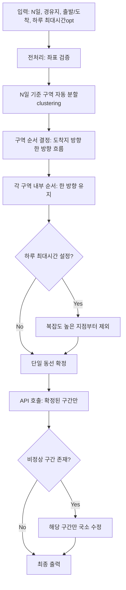

# 대중교통 경로 최적화 알고리즘 설계서

## OurRoad — "직관적 보기 좋음 우선 + API 최소화 + N일 구역 분할"

---

# Part 1. 핵심 전략 (Core Strategy)

## 1.1 설계 철학

> **"최단시간 최적화가 아니라 사용자 납득과 실행 가능성을 우선한다"**

### 문제 인식

기존 대중교통 경로 최적화의 한계:

1. **API 비용 폭증**: 전체 지점쌍 호출 시 O(n²) 복잡도
2. **사용자 불신**: 시간 최적이어도 "빙글빙글/교차/되돌아감"은 납득 안 됨
3. **실행 난이도**: 복잡한 환승/대기는 실제 이동 시 스트레스 유발

### 해결 방향

```
1단계: 좌표 기반으로 "보기 좋은 단일 동선" 생성 (시간 고려 X)
2단계: 해당 동선의 구간만 API로 검증 (O(n) 호출)
3단계: 비정상 구간만 국소 수정
```

**API 호출 최소화**:
- ❌ 전체 행렬: n(n-1) ≈ O(n²)
- ✅ 단일 동선 구간: n개 ≈ O(n)

---

## 1.2 "보기 좋음" 정의 (직관 점수)

시간이 아닌 **형태/인지적 단순성**을 점수화:

| 지표 | 의미 | 중요도 |
|------|------|--------|
| **구역 분산도** (ZoneDispersion) | N일차에 맞춰 가까운 곳끼리 묶임 | 최우선 (w_D) |
| **되돌아감** (Backtracking) | 진행 방향 축 역행 정도 | 2순위 (w_B) |
| **교차** (Crossing) | 경로 선분이 교차하는 횟수 | 3순위 (w_A) |
| **꺾임/회전** | 방향 변화 각도 | 거의 무시 |

**목적함수**:
```
minimize: w_D · ZoneDispersion(C) + w_B · Backtracking(π) + w_A · Crossing(π)
```

---

# Part 2. 알고리즘 구조 (Architecture)

## 2.1 전체 흐름도



---

## 2.2 핵심 로직 (Pseudocode)

```typescript
function generatePublicTransitRoute(input: TripInput): TripOutput {

  // PHASE 1: 전처리
  const waypoints = preprocessWaypoints(input.waypoints);
  const mode = determineTripMode(input.lodging, input.start, input.end);

  // PHASE 2: N일 구역 분할
  const targetPerDay = Math.ceil(waypoints.length / input.days);
  const clusters = balancedClustering({
    waypoints,
    N: input.days,
    targetPerDay,
    fixedIds: waypoints.filter(w => w.isFixed).map(w => w.id)
  });

  // PHASE 3: 구역 간 순서 (한 방향 흐름)
  const endAnchor = chooseEndAnchor(input.lodging, clusters, input.days);
  const orderedClusters = orderClustersOneDirection(clusters, endAnchor);

  // PHASE 4: 구역 내 순서 (한 방향 유지)
  const dayPlans = orderedClusters.map((cluster, dayIndex) => {
    const dayEndAnchor = resolveDayEndAnchor({
      dayIndex,
      orderedClusters,
      endAnchor,
      input
    });

    const route = orderWithinClusterOneDirection({
      cluster,
      endAnchor: dayEndAnchor
    });

    return {
      dayIndex: dayIndex + 1,
      waypointOrder: route,
      excludedWaypointIds: []
    };
  });

  // PHASE 5: 시간 제한 대응 (옵션)
  if (input.dailyMaxMinutes) {
    while (exceedsDailyLimitProxy(dayPlans, input.dailyMaxMinutes)) {
      const worstPoint = selectWorstComplexityPoint(dayPlans, fixedIds);
      if (!worstPoint) break;
      removeWaypoint(dayPlans, worstPoint);
    }
  }

  // PHASE 6: API 검증 (구간만 호출)
  const segmentCosts = await callRoutingAPIForSegments(dayPlans);

  // PHASE 7: 이상 구간 처리
  const warnings = detectAnomalousSegments(segmentCosts);
  if (warnings.length > 0) {
    applyLocalFixes(dayPlans, warnings);
  }

  return buildOutput(dayPlans, segmentCosts, clusters, mode);
}
```

---

# Part 3. 세부 알고리즘 (Detailed Algorithms)

## 3.1 구역 자동 분할 (balancedClustering)

**목표**: N일에 맞춰 가까운 곳끼리 묶되, 하루 분량이 균등하게

**전략**:

```typescript
function balancedClustering(params: {
  waypoints: Waypoint[],
  N: number,
  targetPerDay: number,
  fixedIds: string[]
}): Cluster[] {

  // Step 1: 초기 시드 선택 (멀리 떨어진 대표점 N개)
  const seeds = selectDistributedSeeds(params.waypoints, params.N);

  // Step 2: 각 지점을 가장 가까운 시드에 할당 (용량 제한)
  const clusters = initializeClusters(seeds);
  for (const wp of params.waypoints) {
    const nearestCluster = findNearestCluster(clusters, wp, params.targetPerDay);
    nearestCluster.add(wp);
  }

  // Step 3: 균형화 스왑 (큰 클러스터 → 작은 클러스터)
  balanceClusterSizes(clusters, params.targetPerDay);

  // Step 4: 필수 경유지 보호
  ensureFixedWaypointsIncluded(clusters, params.fixedIds);

  return clusters.map(c => ({
    clusterId: generateId(),
    waypointIds: c.waypoints.map(w => w.id),
    centroid: calculateCentroid(c.waypoints)
  }));
}
```

**핵심 지표**:
- 구역 내 평균 거리 최소화
- 구역 간 크기 분산 최소화
- 필수 경유지는 항상 포함

---

## 3.2 구역 순서 결정 (orderClustersOneDirection)

**목표**: 도착지(숙소) 방향으로 한 방향 흐름 생성

```typescript
function orderClustersOneDirection(
  clusters: Cluster[],
  endAnchor: LatLng
): Cluster[] {

  // Step 1: 각 구역의 중심점 계산
  const centroids = clusters.map(c => c.centroid);

  // Step 2: endAnchor와의 거리로 1차 정렬
  const sorted = clusters.sort((a, b) =>
    distance(a.centroid, endAnchor) - distance(b.centroid, endAnchor)
  );

  // Step 3: 인접 구역 간 점프가 너무 크면 재정렬 (로컬 스무딩)
  return smoothClusterOrder(sorted, endAnchor);
}
```

**한 방향 흐름 검증**:
```typescript
// 진행 방향 벡터와의 내적이 양수여야 함
function validateMonotonicProgression(orderedClusters: Cluster[], endAnchor: LatLng): boolean {
  const directionVector = calculateDirectionVector(orderedClusters[0].centroid, endAnchor);

  for (let i = 0; i < orderedClusters.length - 1; i++) {
    const progress = dotProduct(
      directionVector,
      orderedClusters[i + 1].centroid - orderedClusters[i].centroid
    );
    if (progress < 0) return false; // 되돌아감 발생
  }
  return true;
}
```

---

## 3.3 구역 내 순서 (orderWithinClusterOneDirection)

### 3.3.1 일자별 end anchor 결정 (resolveDayEndAnchor)

**목표**: 각 일차의 마지막 경유지가 그날의 종점(end anchor)에 가장 가깝도록 기준점을 확정한다.

**규칙**:
- 숙소가 있으면 → 모든 일자 end anchor = 숙소
- 숙소가 없고 end가 있으면 → 마지막 날 end anchor = end
- 그 외 일자 → 다음 날 클러스터 중심(centroid)을 end anchor로 사용
- 마지막 날에 end가 없으면 → 루프(시작점) 또는 다음 날 추정 중심으로 대체

**정의**:
- end anchor는 "해당 일자의 동선이 수렴해야 하는 기준점"
- 이후 정렬 과정에서 end anchor에 가까운 경유지가 마지막으로 배치된다.

---

**목표**: 구역 내에서도 다음 구역 방향으로 흐름 유지

```typescript
function orderWithinClusterOneDirection(params: {
  cluster: Cluster,
  endAnchor: LatLng // 해당 일자의 종점(end anchor)
}): string[] {

  const waypoints = cluster.waypoints;

  // Step 1: 진행 축 결정 (현재 구역 중심 → end anchor)
  const axis = calculateAxis(cluster.centroid, params.endAnchor);

  // Step 2: 축에 따라 투영 정렬
  const projected = waypoints.map(wp => ({
    id: wp.id,
    projection: projectOntoAxis(wp.coord, axis)
  }));

  const sorted = projected.sort((a, b) => a.projection - b.projection);

  // Step 2-1: 동일 투영값일 때 end anchor에 더 가까운 경유지를 뒤로 배치
  // -> 마지막 경유지가 end anchor에 가장 가깝게 유지

  // Step 3: 인접 지점 간 교차 최소화 (2-opt 로컬 최적화)
  return minimize2OptCrossing(sorted.map(p => p.id), waypoints);
}
```

---

## 3.4 복잡도 기반 제외 (selectWorstComplexityPoint)

**목표**: 시간 제한 초과 시 "동선을 가장 복잡하게 만드는 지점" 제거

**복잡도 영향 점수**:

```typescript
function calculateComplexityImpact(
  waypoint: Waypoint,
  currentRoute: string[]
): number {

  // 해당 지점을 제거했을 때의 개선도
  const withPoint = {
    backtracking: calculateBacktracking(currentRoute),
    crossing: calculateCrossing(currentRoute)
  };

  const routeWithoutPoint = currentRoute.filter(id => id !== waypoint.id);
  const withoutPoint = {
    backtracking: calculateBacktracking(routeWithoutPoint),
    crossing: calculateCrossing(routeWithoutPoint)
  };

  // 제거 시 개선되는 정도 (높을수록 제거 우선순위 높음)
  return (
    ALPHA * (withPoint.backtracking - withoutPoint.backtracking) +
    BETA * (withPoint.crossing - withoutPoint.crossing)
  );
}

// ALPHA > BETA (되돌아감이 교차보다 중요)
const ALPHA = 2.0;
const BETA = 1.0;
```

---

# Part 4. API 호출 전략 (API Minimization)

## 4.1 구간만 호출하는 규칙

확정된 동선이 `Day1: [A→B→C], Day2: [D→E→F]`이면:

**호출 구간**:
```
출발 → A
A → B
B → C
C → 숙소 (있으면)

숙소 → D (또는 C → D)
D → E
E → F
F → 도착
```

**호출량**: 약 n개 (경유지 수만큼)

---

## 4.2 API 검증 목적

> "최단시간 달성이 아니라 실패 방지"

### 비정상 구간 감지 기준

| 항목 | 임계치 | 처리 |
|------|--------|------|
| 구간 소요시간 | 20분 초과 | 경고 플래그 |
| 환승 횟수 | 2회 초과 | 경고 플래그 |
| 대기 시간 | 8분 초과 | 경고 플래그 |
| 전체 일일 시간 | 설정값 +15% 초과 | 경고 플래그 |

### 경고 플래그 처리

```typescript
function detectAnomalousSegments(segmentCosts: SegmentCost[]): Warning[] {
  const warnings: Warning[] = [];

  for (const segment of segmentCosts) {
    if (segment.durationMinutes > 20) {
      warnings.push({
        type: 'LONG_DURATION',
        segment,
        suggestion: '중간 경유지 추가 또는 순서 변경'
      });
    }

    if (segment.transfers && segment.transfers > 2) {
      warnings.push({
        type: 'TOO_MANY_TRANSFERS',
        segment,
        suggestion: '직접 연결 가능한 경로로 재탐색'
      });
    }
  }

  return warnings;
}
```

**처리 원칙**:
- 전체 경로를 다시 만들지 않음
- 해당 구간 주변만 국소 수정
- 보기 좋음의 일관성 유지

---

# Part 5. 데이터 구조 (Data Schema)

## 5.1 TypeScript Interfaces

```typescript
// 입력
export interface TripInput {
  tripId: string;
  days: number; // N일
  start: LatLng;
  end?: LatLng;
  lodging?: LatLng; // 숙소 (루프 경로 시)
  dailyMaxMinutes?: number; // 하루 최대 활동 시간
  waypoints: Waypoint[];
}

export interface Waypoint {
  id: string;
  name: string;
  coord: LatLng;
  isFixed: boolean; // 필수 경유지
  dayLock?: number; // 특정 일차 고정 (향후 확장)
}

// 중간 결과
export interface Cluster {
  clusterId: string;
  dayIndex?: number; // 1..N
  waypointIds: string[];
  centroid: LatLng;
}

export interface DayPlan {
  dayIndex: number;
  waypointOrder: string[]; // waypoint id 순서
  excludedWaypointIds: string[]; // 제외된 항목
}

// API 결과
export interface SegmentCost {
  key: { fromId: string; toId: string };
  durationMinutes: number;
  distanceMeters?: number;
  transfers?: number;
  waitTimeMinutes?: number;
  polyline?: string; // 지도 렌더링용
}

// 최종 출력
export interface TripOutput {
  tripId: string;
  mode: 'OPEN' | 'LOOP';
  clusters: Cluster[];
  dayPlans: DayPlan[];
  segmentCosts: SegmentCost[];
}
```

---

# Part 6. 예외 처리 (Edge Cases)

## 6.1 입력 예외

| 케이스 | 전략 |
|--------|------|
| N > M (일수 > 장소) | 빈 날 허용 또는 자유시간 dayPlan 생성 |
| 좌표가 극단적으로 분산 | 구역 응집도 우선, 균등은 가능한 선에서 |
| 중복 좌표 | 동일 좌표 병합 + alias 처리 |
| 필수 경유지 과다 | 필수 우선 배치 후 남은 슬롯에 선택 경유지 |

## 6.2 API 예외

| 케이스 | 전략 |
|--------|------|
| API 타임아웃/실패 | 재시도 + 실패 시 거리 기반 대체 시간 |
| 경로 없음 (미지원 구간) | 도보/택시 fallback 표기 |
| 하루 시간 초과 (API 확인 후) | 복잡도 기반 제외 → 1회만 재호출 |

---

# Part 7. 구현 우선순위

## Phase 1: 핵심 기능 (MVP)
- [ ] 구역 자동 분할 (balancedClustering)
- [ ] N일 균등 분배
- [ ] 한 방향 흐름 생성 (구역 간/구역 내)
- [ ] 최종 API 구간 호출

## Phase 2: 안정화
- [ ] 비정상 구간 감지 및 경고
- [ ] 복잡도 기반 제외 (시간 제한 대응)
- [ ] API 실패 처리 및 폴백

## Phase 3: 고도화
- [ ] 숙소 미지정 시 종료점 자동 추정
- [ ] 사용자 선호도 반영 (교차/되돌아감 가중치 조정)
- [ ] 실시간 배차 정보 반영 (가능 시)

---

# Part 8. 성공 지표 (Success Metrics)

## 기술 지표
- API 호출 수: O(n) 유지 (n = 경유지 수)
- 평균 API 응답시간: < 2초 (전체 동선 생성)
- 동선 생성 실패율: < 5%

## 사용자 경험 지표
- 되돌아감 발생률: < 10% (전체 구간 대비)
- 교차 발생률: < 5%
- 구역 내 평균 거리: < 2km (도시 기준)
- 일일 분량 균등도: 표준편차 < 1.5개

## 비즈니스 지표
- API 비용: 기존 대비 80% 이상 절감
- 경로 수정 요청률: < 20%
- 사용자 만족도: 4.0/5.0 이상

---

# Appendix: 알고리즘 복잡도 분석

| 단계 | 복잡도 | 설명 |
|------|--------|------|
| 구역 분할 (k-means 변형) | O(n · k · i) | n=지점, k=구역, i=반복 (~10) |
| 구역 순서 정렬 | O(k log k) | k개 구역 정렬 |
| 구역 내 순서 (2-opt) | O(m²) | m=구역당 평균 지점 수 |
| API 호출 | O(n) | 구간 수 = 지점 수 |
| **전체** | **O(n · k)** | k ≈ N (일수), 보통 N << n |

**기존 TSP 기반 접근**: O(n!) 또는 O(n² · 2ⁿ) (동적계획법)

**API 호출 비교**:
- 기존 (전체 행렬): n(n-1) ≈ O(n²)
- 제안 (구간만): n ≈ O(n)
- **비용 절감**: 약 n배 (예: 10개 지점 시 90회 → 10회)

---

# 참고 자료

1. 해결전략(API최소화).md - 전략적 근거 및 사용자 납득 논리
2. API최소화_알고리즘_상세설계서.md - 수학적 정의 및 전체 시스템 설계
3. Vehicle Routing Problem (VRP) with Time Windows - 이론적 배경
4. Cognitive Load Theory - "보기 좋음"의 심리학적 근거
